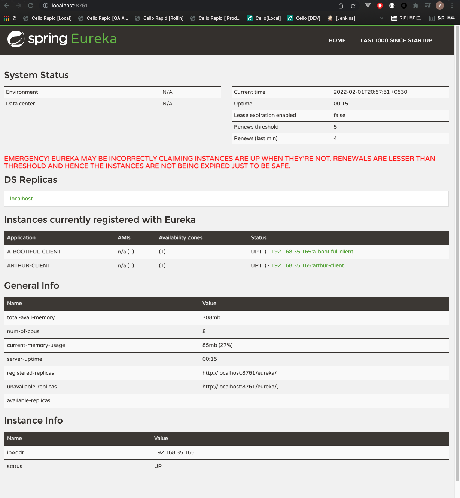

# Spring Cloud Eureka Learn

to learn service registration and discovery

## Eureka 대시보드



## 레지스트리 자체 등록 비활성화

```properties
eureka.client.register-with-eureka=false
eureka.client.fetch-registry=false
```

## Service Instance

```json
[
   {
      "uri":"http://192.168.35.165:8080",
      "secure":false,
      "instanceInfo":{
         "instanceId":"192.168.35.165:a-bootiful-client",
         "app":"A-BOOTIFUL-CLIENT",
         "appGroupName":null,
         "ipAddr":"192.168.35.165",
         "sid":"na",
         "homePageUrl":"http://192.168.35.165:8080/",
         "statusPageUrl":"http://192.168.35.165:8080/actuator/info",
         "healthCheckUrl":"http://192.168.35.165:8080/actuator/health",
         "secureHealthCheckUrl":null,
         "vipAddress":"a-bootiful-client",
         "secureVipAddress":"a-bootiful-client",
         "countryId":1,
         "dataCenterInfo":{
            "@class":"com.netflix.appinfo.InstanceInfo$DefaultDataCenterInfo",
            "name":"MyOwn"
         },
         "hostName":"192.168.35.165",
         "status":"UP",
         "overriddenStatus":"UNKNOWN",
         "leaseInfo":{
            "renewalIntervalInSecs":30,
            "durationInSecs":90,
            "registrationTimestamp":1643728715787,
            "lastRenewalTimestamp":1643728835718,
            "evictionTimestamp":0,
            "serviceUpTimestamp":1643728715271
         },
         "isCoordinatingDiscoveryServer":false,
         "metadata":{
            "management.port":"8080"
         },
         "lastUpdatedTimestamp":1643728715787,
         "lastDirtyTimestamp":1643728715189,
         "actionType":"ADDED",
         "asgName":null
      },
      "instanceId":"192.168.35.165:a-bootiful-client",
      "serviceId":"A-BOOTIFUL-CLIENT",
      "metadata":{
         "management.port":"8080"
      },
      "port":8080,
      "host":"192.168.35.165",
      "scheme":"http"
   }
]
```

## Error Resolved List

### java.lang.ClassNotFoundException: org.springframework.boot.Bootstrapper

> Spring Boot version 2.6.1에서 2.4.1 로 다운그레이드

```xml
<version>2.4.1</version>
```

### 'com.netflix.discovery.DiscoveryClient' that could not be found.

> DiscoveryClient를 상속받은 EurekaDiscoveryClient는 Bean으로 생성 되어있음.

```java
@Autowired
private EurekaDiscoveryClient discoveryClient;
```